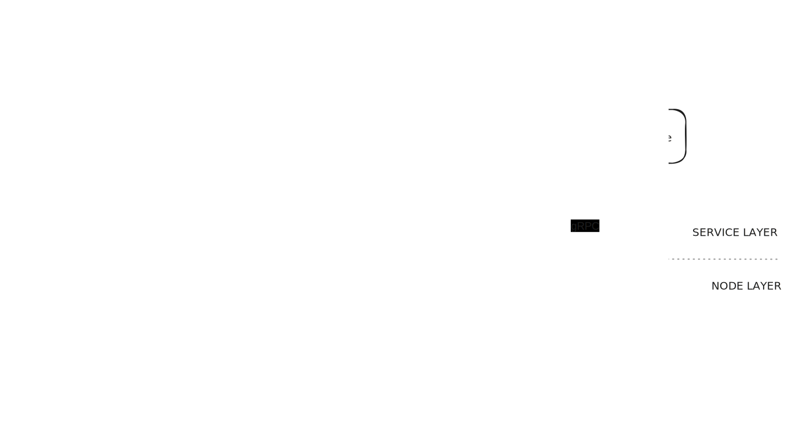

# faq

### How do multiple clients make requests to a specific service?

Based on the architecture developed earlier, if a client wants to use a service, it requests the creation of an instance of it on a node. Therefore, if n clients want to use the service, n instances of it will be needed. In the end, an instance of a service, a container, is nothing more than an isolated thread. Therefore, the client/server paradigm is altered when talking about services on a trustless distributed system. Instead of one server serving multiple clients, a client requests the deployment of a service. In terms of performance, there should not be a big difference between one scheme and another, since the centralized server ends up executing n threads for n client requests. In distributed services, these threads are isolated (which can be a negative point regarding shared memory usage, but this is solved with some other patterns) and are distributed among the nodes in the network.

To create a web service that can be connected to a frontend in a browser, a new service is required to handle incoming requests from clients and deploy and use the classification service. This service, as shown in *Figure 118*, can be understood as a bridge between the "traditional web" and a distributed service network.

*__Figure 118__: Celaut service bridge to a common web pattern*

 

### Multiple instances cannot share dependencies

The nature of the network creates a hierarchy of service instances distributed across the nodes of the same. 
This means that when an instance (parent) requests an instance of another service (child or dependency), the latter will become dependent on the former, with the parent assuming the right to decide when the child should be stopped and the responsibility for its resource consumption (in case a node tracks the consumption of each instance, it must take into account that of its dependencies). 

In this way, if the parent is stopped, the node where its child is running can stop it. If it were not so, a node would not know which instances are in a 'zombie' state since none of its clients (parent instances) would be responsible.

 

### Why include the entire filesystem in the specification of a service?

The specification of a service must define it completely and comprehensively to avoid redundancy among different services. 

This can lead to problems such as the size of the specification, but these problems can be solved in a higher abstraction layer, such as the 
[pee-rpc protocol](https://github.com/pee-rpc-protocol/pee-rpc#using-blocks-buffer-containers)
does.

>Using Dockerfiles to define a service would not be possible to verify the authenticity of the container, since the Dockerfile defines how to build the container and, generally, are download instructions from central repositories, and they can change the result over the time. A node can accept a specification that uses Dockerfiles, but it would not be in line with the principles of the architecture.

 

### Hash Algorithm Identification

To avoid collisions when identifying different hash algorithms, they are identified by applying their own algorithm to an empty input, that is, an empty bit string. 

For example:
- **Sha2562-256 utf-8**: e3b0c44298fc1c149afbf4c8996fb92427ae41e4649b934ca495991b7852b855

- **Sha3-256 uft-8**: a7ffc6f8bf1ed76651c14756a061d662f580ff4de43b49fa82d80a4b80f8434a

- **Shake-256 utf-8 of 256 bits**: 46b9dd2b0ba88d13233b3feb743eeb243fcd52ea62b81b82b50c27646ed5762f

- **Sha2562-256 utf-8 over Sha256-256 utf-8**: cd372fb85148700fa88095e3492d3f9f5beb43e555e5ff26d95f5a6adc36f8e6

 

In this way, the word "*CELAUT*" would be:
- Sha2562-256 utf-8:

    - type: e3b0c44298fc1c149afbf4c8996fb92427ae41e4649b934ca495991b7852b855
    - value: d7f901be75b36a2ccef2fcc61f9c0665af4155ccee1eda8c4afa1a4f994e825c 
    
- Sha3-256 utf-8:
    - type: a7ffc6f8bf1ed76651c14756a061d662f580ff4de43b49fa82d80a4b80f8434a
    - value: de1a91208f7c6d320cbc50e45952fe40cb18a949f8a4daae0f8428fc60523f09

- Shake-256 utf-8 of 256 bits:
    - type: 46b9dd2b0ba88d13233b3feb743eeb243fcd52ea62b81b82b50c27646ed5762f
    - value: d10ca3f8a2ab79a8b841876780d232770e70a22cbcc8769a0a1a44194702ee7c

 

To avoid collisions with similar algorithms 
(or variations of one, is the same) 
double algorithm identification could be used, for example:
- Sha2562-256 utf-8 over Sha256-256 utf-8:

    - type: cd372fb85148700fa88095e3492d3f9f5beb43e555e5ff26d95f5a6adc36f8e6
    - value: 22bcde154d5f214fe34a5e2b862c0b5aee07d04f62b293b749727ce4b2bea9ad 

 

In this way, no centralized registry is required to agree on which identifier corresponds to a specific algorithm.

>In the same way as in the case described in the question regarding the file system, a node is not required to use this hash identification format. This solution is presented because it is in line with the CELAUT principles.

Other way to solve the problem could be 
[multihash from Protocol Labs](https://github.com/multiformats/multihash#format).
But it needs to have a consensus to say what algorithms has what identifier codes.

### How does CELAUT's peer-to-peer network architecture relate to orchestrators like Kubernetes or  Apache Mesos ?

The primary distinction lies in the hierarchical structure of both 
[Kubernetes](https://kubernetes.io/docs/concepts/architecture/nodes/)  and 
[Apache Mesos](https://mesos.apache.org/documentation/latest/architecture/)
, where a single master node oversees a collection of subordinate nodes, or minions. 
In contrast, CELAUT employs a decentralized approach, where no individual node holds authority over another, fostering a trustless environment that can support a vast and globally distributed computational network.

CELAUT offers several integration and utilization possibilities with existing systems:

- Evolving them so that the node operates as a master node in these systems and treats the other peers as subordinate minions (even if they are not, meaning compensating them).

- Operating as standalone services within the distributed network, assuming responsibility for load balancing and coordinating other child services in a centralized fashion. This role can prove beneficial for applications requiring centralized control and orchestration.

- Employing them within traditional centralized server environments, recognizing that CELAUT's inherent trustlessness may not be essential when all nodes are under the control of a single organization. In such scenarios, the master node assumes the responsibility of connecting to external nodes via the CELAUT architecture.

 
 

## Roadmap

This section covers the past and future development of the project by the initial development team (it is updated over time)

[Link to the roadmap](roadmap.md)

 

## Links

[Proof of Concept: CELAUT over IPFS, Feb '21](https://discuss.ipfs.tech/t/proof-of-concept-interplanetary-service-system/10245)

[Ergo-forum conversation, Aug '23](https://www.ergoforum.org/t/artifical-economic-intelligence-on-ergo-blockchain/4429/2)

>IPFS or Ergo are not platforms on which the architecture is based, although both are aligned with the CELAUT principles.

 
